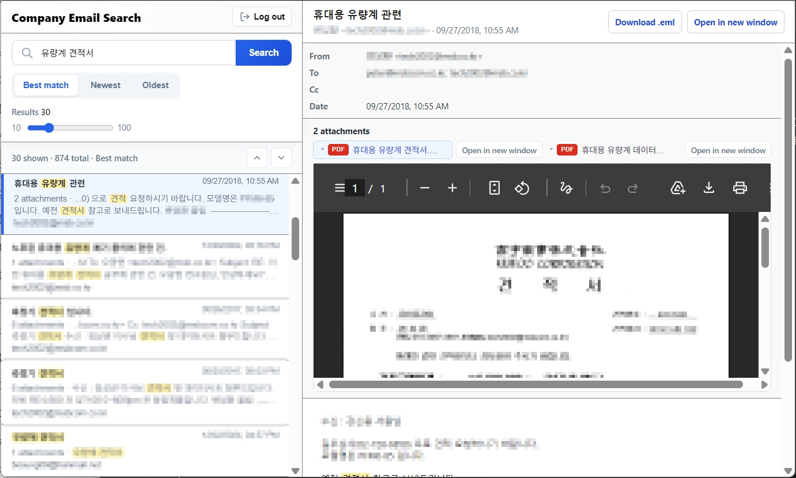

# OpenArchiver Search Viewer

A web app for quickly searching archived emails through the [OpenArchiver](https://github.com/LogicLabs-OU/OpenArchiver) API in an Outlook-style interface.

This project is not an official OpenArchiver project.

You need API access to a running OpenArchiver server.

Tested with OpenArchiver v0.5.0



## Features

- Adjust the number of search results to filter out less relevant emails.
- View search results on the left and read email contents directly on the right.
- Sort search results chronologically.
- Preview attachments.
- Highlight search keywords in the email body.

## Setup

Clone the repository and move into the project directory.

```powershell
git clone https://github.com/nadong-0/openarchiver_search_viewer.git
cd openarchiver_search_viewer
```

This project manages Python execution with `uv`. If you do not have `uv`, install it first.

```powershell
uv sync
```

Copy `.env.example` to `.env` and update the values.

```powershell
Copy-Item .env.example .env
```

Required `.env` values:

- `OPENARCHIVER_API_KEY`: OpenArchiver API key
- `OPENARCHIVER_URL`: OpenArchiver root URL
- `SITE_PASSWORD`: App login password. Required only when `app.need_log_in = true` in `config.toml`.

## Run

Local server:

```powershell
uv run uvicorn app:app --host 127.0.0.1 --port 8000
```

Open:

```text
http://localhost:8000/
```

If the server must be accessed from another PC, run it with `--host 0.0.0.0`.

```powershell
uv run uvicorn app:app --host 0.0.0.0 --port 8000
```

Open:

```text
http://SERVER_IP:8000/
```

## Additional Configuration

The app works without changing these settings, but you can adjust several options.

`config.toml` options:

- `app.need_log_in`: Enables app login when set to `true`.
- `app.language`: App language. Supports `ko` or `en`.
- `app.title`: App title.
- `openarchiver.api_search`: Search API path.
- `openarchiver.api_mail_get`: Email detail API path. The email ID is appended to the end.
- `openarchiver.api_storage_download`: Download API path for original emails and attachments.
- `search.matching_strategy`: OpenArchiver search `matchingStrategy` value.
- `search.max_limit`: Maximum number of search results.
- `search.enable_exact_filter`: Shows the exact-match filter on the screen when set to `true`.

## Notes

Although the app only uses read operations through the API, it is recommended to grant the API key read-only permissions.

This project has limited security protections and is not responsible for any issues that occur during use.

---

# Korean

# OpenArchiver 검색 뷰어

[OpenArchiver](https://github.com/LogicLabs-OU/OpenArchiver) API를 이용해 아카이빙된 이메일을 Outlook 스타일로 빠르게 검색할 수 있는 웹앱입니다.

이 프로젝트는 OpenArchiver의 공식 프로젝트가 아닙니다.

운영중인 OpenArchiver 서버에 API 접근이 가능해야 합니다.

OpenArchiver v0.5.0 에서 테스트 되었습니다.


## 특징

- 검색 결과 수를 조절할 수 있어서 관련성이 낮은 메일을 걸러낼 수 있습니다.
- 좌측에 검색 결과가 나오고 우측에서 메일을 바로 확인할 수 있습니다.
- 검색 결과를 시간순으로 정렬할 수 있습니다.
- 첨부파일을 미리볼 수 있습니다.
- 본문에서 검색 키워드를 하이라이트 해줍니다.

## 준비

저장소를 복제하고 해당 디렉토리로 이동합니다.

```powershell
git clone https://github.com/nadong-0/openarchiver_search_viewer.git
cd openarchiver_search_viewer
```

이 프로젝트는 Python 실행을 `uv`로 관리합니다. `uv`가 없다면 먼저 설치해야 합니다.

```powershell
uv sync
```

`.env.example`을 `.env`로 복사하고 값을 수정합니다.

```powershell
Copy-Item .env.example .env
```

`.env` 필수 값:

- `OPENARCHIVER_API_KEY`: OpenArchiver API 키
- `OPENARCHIVER_URL`: OpenArchiver 루트 URL
- `SITE_PASSWORD`: 앱 로그인 비밀번호. config.toml 에서 `app.need_log_in = true`일 때만 필수입니다.


## 실행

로컬 서버:

```powershell
uv run uvicorn app:app --host 127.0.0.1 --port 8000
```

접속:

```text
http://localhost:8000/
```

다른 PC에서 접속해야 하는 서버라면 `--host 0.0.0.0`으로 실행합니다.

```powershell
uv run uvicorn app:app --host 0.0.0.0 --port 8000
```

접속:

```text
http://서버IP:8000/
```


## 추가 설정

변경하지 않아도 동작하지만 몇가지 옵션을 조절할 수 있습니다.

`config.toml` 옵션:

- `app.need_log_in`: `true`이면 앱 로그인 사용
- `app.language`: 앱 언어. `ko` 또는 `en`을 지원합니다.
- `app.title`: 앱 제목
- `openarchiver.api_search`: 검색 API 경로
- `openarchiver.api_mail_get`: 메일 상세 API 경로. 끝에 메일 ID가 붙습니다.
- `openarchiver.api_storage_download`: 원본 메일과 첨부파일 다운로드 API 경로
- `search.matching_strategy`: OpenArchiver 검색 matchingStrategy 값
- `search.max_limit`: 검색결과수 최대값.
- `search.enable_exact_filter`: `true`이면 완전일치 필터를 화면에 표시합니다.

## 주의사항

API에서 읽는 기능만 사용하지만 API키를 읽기권한만 주는 것을 권장합니다.

이 프로젝트는 보안성이 낮으며 사용상 발생하는 어떤 문제에 대해서도 책임지지 않습니다.

